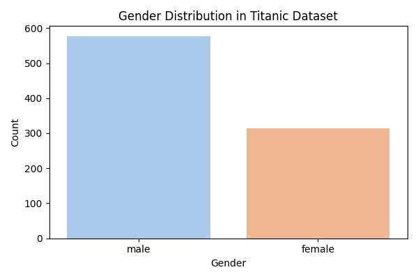
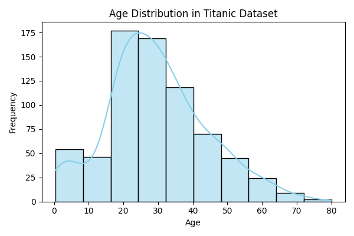

# Data Visualization Task - Internship Project

This project visualizes the distribution of **categorical** and **continuous** variables using Python.

## 📊 Visualizations:
- **Bar Chart** for Gender (Male/Female)
- **Histogram** for Age distribution

## 🛠 Tools Used:
- Python
- Google Colab
- Pandas, Matplotlib, Seaborn

## ▶️ How to Run:
1. Upload `train.csv` into Google Colab
2. Run `visualization.py` to generate:
   - `gender_distribution.png`
   - `age_distribution.png`

## 📷 Sample Output

  

